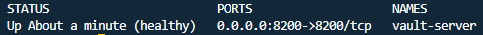
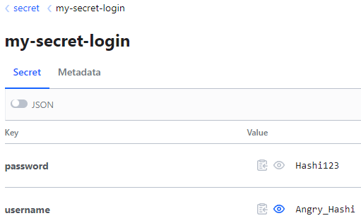

# HashiCorp Vault Server Setup
## Short description
___
Setup and deploy a Vault server so that you can to store your secrets, and access them with code.

## Pre-requisites
___
### `Ubuntu` with the following installed:
- [Miniconda3](https://docs.conda.io/en/latest/miniconda.html) 
- [Docker](https://docs.docker.com/engine/install/ubuntu/)
- [Docker Compose](https://docs.docker.com/compose/install/linux/)

You could use `WSL2` on a `Windows` machine, as an alternative to an `Ubuntu` machine.

## Setup your machine (local or remote server)
___
### 2. Launch the Docker Container
- Clone this repo and navigate inside:
```bash
git clone https://github.com/pandego/hashicorp-vault-server-setup.git
cd ./hashicorp-vault-server-setup
```
- Edit `default.env` to your own preferred *secrets*:
- Launch the `docker-compose` command to build and start the `vault-server` service:
```bash
docker-compose --env-file default.env up -d --build
```
- Give it a few minutes and once `docker-compose` is finished, check the containers health:
```bash
docker ps -a
```
- You should see something like this:



- You should also be able to navigate to the HashiCorp UI -> http://localhost:8200

That's it! 🥳 You can now start using Vault to store and access your secrets! You can find two examples on how to `create` and `read` *secrets* directly from your *Python* code below. 👇🏻


## How to use *Python* code to `create` and `read` your _Secrets_
___
### 1. Create a *Secret*:
- Create and activate your `dev` environment first:
```bash
conda create -n vault_env python=3.10
conda activate vaul_env
pip install hvac
```
- Add this to the environment; edit to your own preferred *secrets*:
```bash
export VAULT_DEV_ROOT_TOKEN_ID=dev-only-token
```

- Navigate into the examples folder:
```bash
cd ./examples/
```

- Withing the `example_1_create_secret.py` file, take special attention the following function; replace the `path` and `username`/`password` with the secrets of your choice:

```python
create_response = client.secrets.kv.v2.create_or_update_secret(path='my-secret-login',
                                                               secret=dict(
                                                                   username='Angry_Hashi',
                                                                   password='Hashi123'),
                                                               )
```

- Launch the script by running the following command on your terminal:
```bash
python example_1_create_secret.py
```
- You should see the following, indicating the script worked:
```bash
$ Secrets written successfully!
```
- If you navigate into the [HashiCorp UI](http://localhost:8200) and login using ***token*** (defined in the `default.env` file), you will find your *secrets*:




### 2. Read the previously created *Secret*:
- Withing the `example_2_read_secret.py` file, take special attention to the following piece of code; that's how you will access your *secrets* through code:
```python
read_response = client.secrets.kv.read_secret_version(path='my-secret-login')

username = read_response['data']['data']['username']
password = read_response['data']['data']['password']
```

- To test the script simply launch the script by running the following command on your terminal:
```bash
python example_2_read_secret.py
```
- You should see the following, indicating the script worked:
```bash
$ Access granted!
```

🎊 ***Et voilà!*** 🎊
___
## References:
- https://developer.hashicorp.com/vault/docs/get-started/developer-qs
- https://hub.docker.com/_/vault

